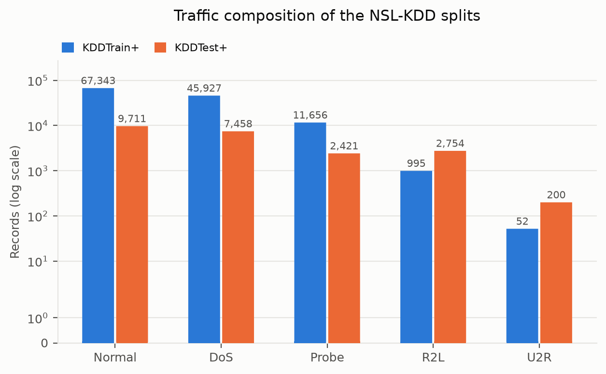
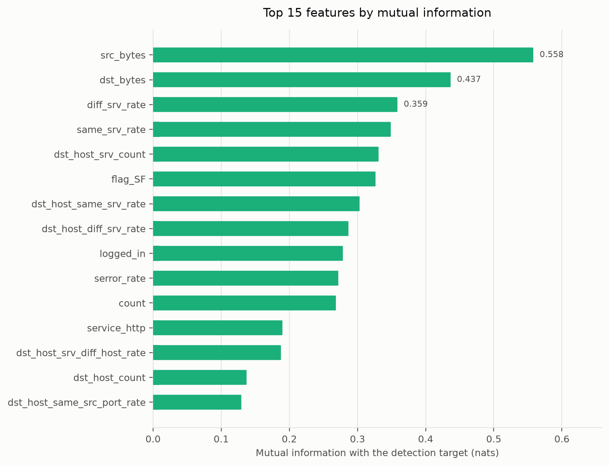
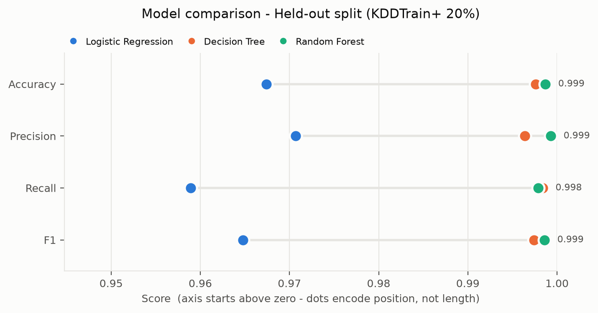
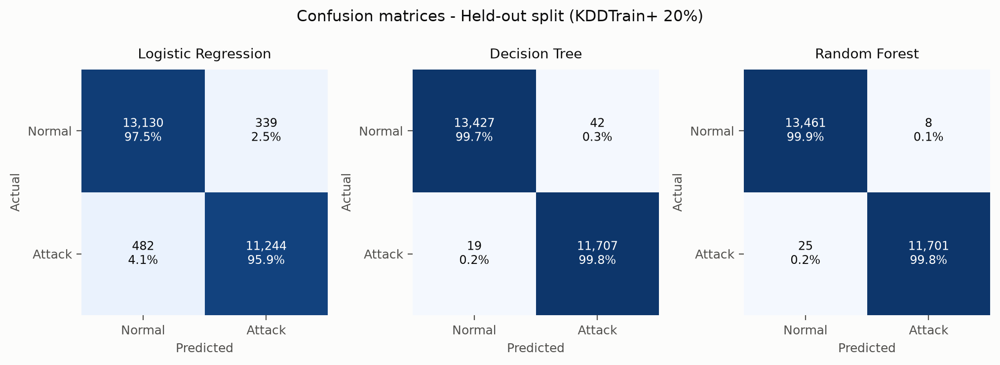
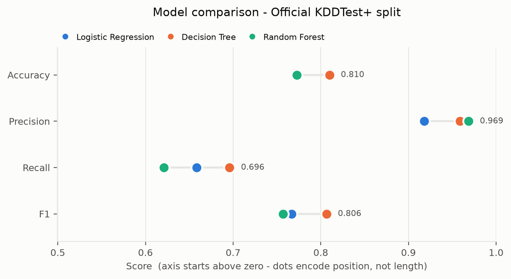
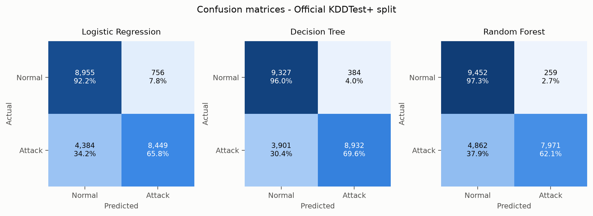
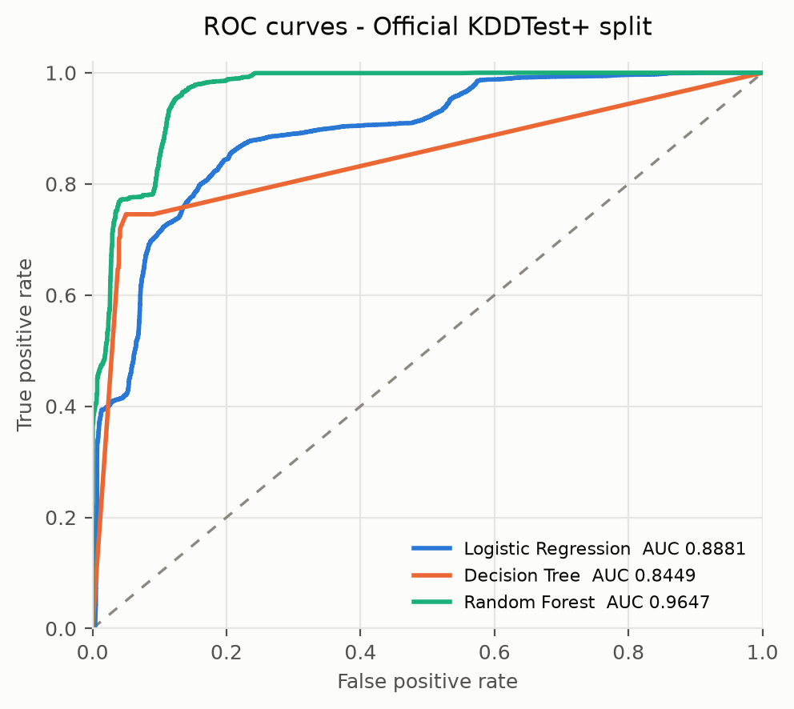
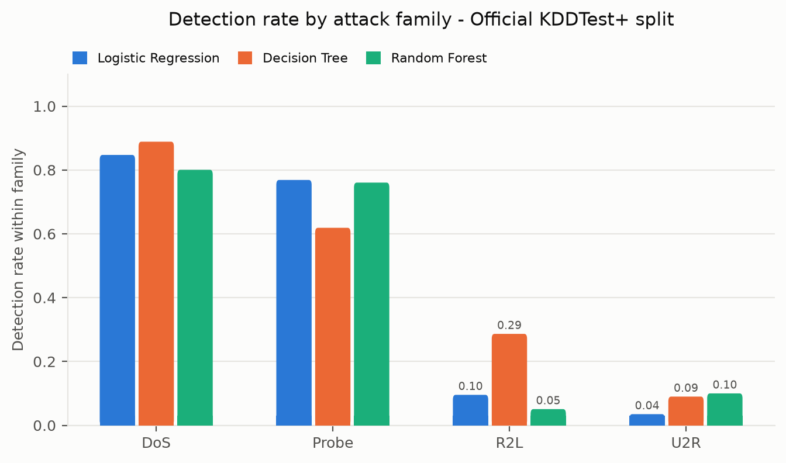
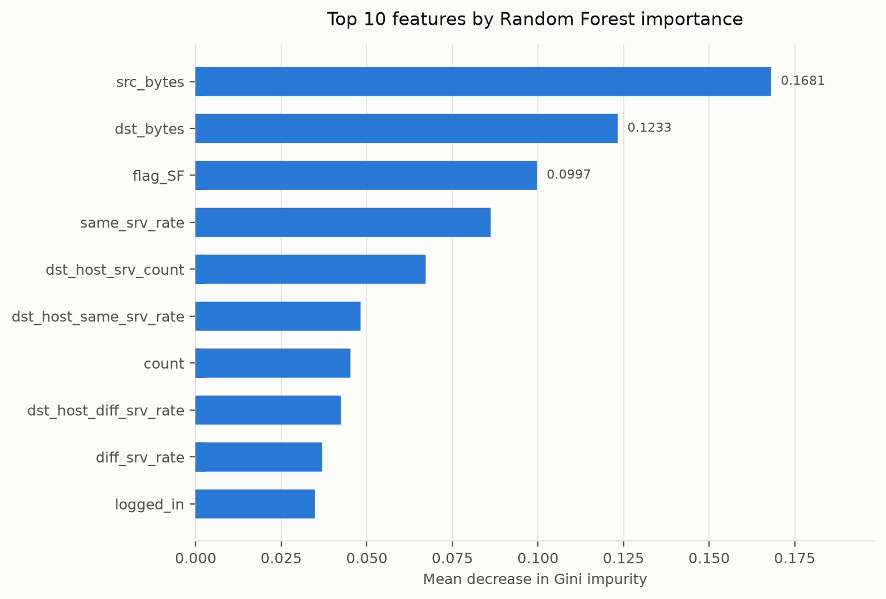

# NetShield-ML — Network Intrusion Detection

### Engineering Documentation

**Authors:** Anurag Jha, Sandesh Dhital

---

## Table of contents

1. [Introduction](#1-introduction)
2. [Network intrusion detection](#2-network-intrusion-detection)
3. [Dataset](#3-dataset)
4. [Data preprocessing](#4-data-preprocessing)
5. [Feature selection](#5-feature-selection)
6. [Machine learning models](#6-machine-learning-models)
7. [Training](#7-training)
8. [Evaluation metrics](#8-evaluation-metrics)
9. [Results](#9-results)
10. [Feature importance](#10-feature-importance)
11. [Limitations](#11-limitations)
12. [Conclusion](#12-conclusion)

---

## 1. Introduction

NetShield-ML compares three classical supervised classifiers — Logistic
Regression, a Decision Tree, and a Random Forest — on the task of separating
malicious network connections from benign ones, and then examines which
properties of a connection the best model actually relies on.

The project has two deliberate constraints:

- **No deep learning.** The inputs are 41 tabular attributes per connection
  record, not sequences or images. On tabular data at this scale, gradient
  ensembles and bagged trees are at or near the practical ceiling; a neural
  model would add training cost and remove the interpretability that makes a
  detector deployable in a security operations centre.
- **Interpretability is a result, not a footnote.** An analyst who cannot see
  *why* a flow was flagged cannot triage the alert. The feature-importance
  analysis in §10 is treated as a primary output alongside the metrics.

The whole study is reproducible with one command (`python main.py`) and a
fixed random seed of 42.

---

## 2. Network intrusion detection

A **network intrusion detection system** (NIDS) inspects traffic and raises an
alert when it believes an attack is in progress. Two broad designs exist:

| Approach | How it decides | Strength | Weakness |
|---|---|---|---|
| Signature-based | matches traffic against a database of known attack patterns | near-zero false alarms on known attacks | blind to anything not already in the database |
| Anomaly / learning-based | models what traffic looks like and flags deviations | can catch previously unseen attacks | more false alarms; needs representative training data |

This project builds a **supervised learning-based detector**: it is shown
labelled examples of normal and malicious connections and learns a decision
boundary between them.

### Why the metric choice matters here

Intrusion detection is a strongly asymmetric problem, and the two error types
have very different costs:

- A **false positive** (benign traffic flagged as an attack) costs analyst
  time. At scale it causes alert fatigue, which is how real intrusions get
  ignored.
- A **false negative** (an intrusion classified as normal) is an undetected
  breach.

Because of this, aggregate accuracy is close to useless on its own. A detector
that misses an entire attack family can still post a high accuracy if that
family is rare, which — as §9 shows — is exactly what happens on this dataset.
Every table in this document therefore reports recall on the attack class, the
false-alarm rate, and the miss rate alongside accuracy.

### The four attack families

The dataset labels each malicious record with a specific attack name, which
maps onto four standard families:

| Family | Meaning | Example labels |
|---|---|---|
| **DoS** | denial of service — exhaust a resource so legitimate users are refused | `neptune`, `smurf`, `back`, `teardrop` |
| **Probe** | reconnaissance — map hosts, ports and services before an attack | `satan`, `ipsweep`, `portsweep`, `nmap` |
| **R2L** | remote to local — gain a local account from a remote machine | `guess_passwd`, `ftp_write`, `warezmaster` |
| **U2R** | user to root — escalate from a normal account to superuser | `buffer_overflow`, `rootkit`, `loadmodule` |

DoS and Probe attacks are loud: they generate many connections with distinctive
traffic statistics. R2L and U2R attacks hide inside a handful of otherwise
ordinary-looking sessions. That asymmetry is the source of nearly every
interesting result in §9.

---

## 3. Dataset

**NSL-KDD**, published by the Canadian Institute for Cybersecurity at the
University of New Brunswick. It is a cleaned redistribution of the KDD Cup '99
corpus in which the enormous number of duplicate records that dominated the
original has been removed — which is what makes an accuracy figure on it
meaningful rather than a measure of how often the same few flows repeat.

### Scale

| Split | Records | Columns |
|---|---|---|
| `KDDTrain+` | 125,973 | 41 features + label + difficulty score |
| `KDDTest+` | 22,544 | 41 features + label + difficulty score |

The pipeline downloads both files into `data/raw/` on first run.

### Feature groups

The 41 features fall into four groups:

| Group | Count | Examples | What they capture |
|---|---|---|---|
| Basic connection | 9 | `duration`, `protocol_type`, `service`, `flag`, `src_bytes`, `dst_bytes` | properties of the individual TCP/UDP/ICMP connection |
| Content | 13 | `hot`, `num_failed_logins`, `logged_in`, `root_shell`, `su_attempted` | payload-derived hints of suspicious activity, aimed at R2L/U2R |
| Time-based traffic | 9 | `count`, `srv_count`, `serror_rate`, `same_srv_rate` | statistics over connections in the past 2 seconds |
| Host-based traffic | 10 | `dst_host_count`, `dst_host_srv_count`, `dst_host_same_srv_rate` | statistics over the last 100 connections to the same host |

Three of the features are **nominal** (`protocol_type`, `service`, `flag`);
the rest are numeric counts, byte totals, rates in [0, 1], or binary flags.

### Class composition

| Split | Category | Records | Share |
|---|---|---:|---:|
| KDDTrain+ | Normal | 67,343 | 53.46% |
| KDDTrain+ | DoS | 45,927 | 36.46% |
| KDDTrain+ | Probe | 11,656 | 9.25% |
| KDDTrain+ | R2L | 995 | 0.79% |
| KDDTrain+ | U2R | 52 | 0.04% |
| KDDTest+ | Normal | 9,711 | 43.08% |
| KDDTest+ | DoS | 7,458 | 33.08% |
| KDDTest+ | R2L | 2,754 | 12.22% |
| KDDTest+ | Probe | 2,421 | 10.74% |
| KDDTest+ | U2R | 200 | 0.89% |



Two things in this table drive the rest of the study:

1. **The binary target is roughly balanced** (46.54% attacks in training), so
   accuracy is not trivially inflated by a majority class — at the binary
   level.
2. **The family-level imbalance is extreme, and the test split is not drawn
   from the same distribution as the training split.** R2L rises from 0.79% of
   training to 12.22% of test; U2R from 52 records to 200. The official test
   file deliberately contains attack *types* that never appear in training.
   This is not a flaw in the dataset — it is the point of it. Real detectors
   meet attacks that postdate their training data.

### The `difficulty` column

Each record carries a trailing integer added by the dataset authors, recording
how many of 21 reference classifiers got that record right. It is metadata
about the dataset, not an observable property of network traffic. It is
**dropped before modelling**: leaving it in would leak the answer and inflate
every score reported here.

---

## 4. Data preprocessing

Implemented in `src/preprocess.py`. Every transformation is **fitted on the
training split only** and then applied to the held-out and official test
splits. Fitting on the whole corpus would leak test-set statistics into the
scaler and the one-hot vocabulary and quietly overstate the results.

### 4.1 Cleaning

| Step | Action | Effect on this dataset |
|---|---|---|
| Drop metadata | remove `difficulty` | prevents target leakage |
| Missing values | median-fill numeric, then drop any remaining incomplete rows | none required — NSL-KDD has no missing cells |
| Duplicate records | drop exact duplicates from the training split | **0 removed** — NSL-KDD is already deduplicated, confirming the published claim |
| Errata | `su_attempted` is documented as binary but contains a stray value of `2`; recoded to `1` | small consistency fix |

Duplicates are deliberately **not** dropped from the official test split: it is
a fixed published benchmark, and altering it would make the numbers
incomparable with other work.

### 4.2 Target construction

The fine-grained attack label is collapsed to a binary detection target:

```
is_attack = 0  if label == "normal"
is_attack = 1  otherwise
```

The original label and the four-way family are retained separately — not as
model inputs, but so the error analysis in §9.4 can break the results down by
attack family.

### 4.3 Encoding

The three nominal columns are **one-hot encoded**. Ordinal (integer) encoding
was rejected: it would impose a false ordering — implying `http < smtp < ftp`
means something — which the tree models would happily split on and the linear
model would treat as a magnitude.

After encoding, the matrix has **121 columns**: 38 numeric and binary features
plus 83 indicator columns generated from `protocol_type`, `service` and `flag`.

Categories present in the test split but absent from training (an unseen
service name) are handled by reindexing the encoded test matrix onto the
training column layout, filling absent indicators with zero. This is covered
by a unit test — it is a common and silent source of shape errors.

### 4.4 Scaling

Continuous features are **standardised** to zero mean and unit variance.

This is essential for Logistic Regression: `src_bytes` ranges over hundreds of
millions while the rate features live in [0, 1], and without scaling the L2
penalty and the L-BFGS solver are dominated by the byte counts. Trees are
scale-invariant and neither gain nor lose from it, so one shared matrix serves
all three models.

One-hot indicators and the binary flags (`land`, `logged_in`, `root_shell`,
`is_host_login`, `is_guest_login`) are **excluded** from scaling so their 0/1
meaning survives into the feature-importance analysis.

---

## 5. Feature selection

Implemented in `src/feature_selection.py` as three stages, fitted on the
training split only.

### Stage 1 — Constant filter

A feature that never varies carries no information. **1 feature dropped:**
`num_outbound_cmds`, which is zero for every record in the dataset.

### Stage 2 — Correlation pruning

For any pair of features with |Pearson r| ≥ 0.95, one is dropped. Near-duplicate
features destabilise the coefficients of a linear model and split a single
tree-importance signal across two columns, which makes §10 harder to read.

**7 features dropped**, each shown with the retained feature it correlates
most strongly with:

| Dropped | Redundant with | \|r\| |
|---|---|---:|
| `num_root` | `num_compromised` | 0.999 |
| `srv_serror_rate` | `serror_rate` | 0.993 |
| `srv_rerror_rate` | `rerror_rate` | 0.989 |
| `dst_host_serror_rate` | `serror_rate` | 0.979 |
| `dst_host_srv_serror_rate` | `srv_serror_rate` | 0.986 |
| `dst_host_srv_rerror_rate` | `srv_rerror_rate` | 0.971 |
| `flag_S0` | `srv_serror_rate` | 0.983 |

The pattern is coherent: the SYN-error and rejection-error rates are computed
over overlapping windows, so the connection-level, service-level and
host-level versions of the same rate move together. `flag_S0` (connection
attempted, no reply) is dropped for the same reason — a half-open connection
*is* a SYN error, so the flag and the rate encode one fact twice.

### Stage 3 — Mutual-information ranking

The 113 surviving features are ranked by mutual information with the detection
target, and the **top 40** are kept.

Mutual information was chosen over an ANOVA F-test because it detects
non-linear and non-monotonic dependence. The byte-count and rate features in
this dataset are heavily skewed, and several are informative in a way an F-test
would miss — attack traffic is not simply "higher" on them, it occupies
different regions.

MI is estimated on a stratified 20,000-row subsample. The k-nearest-neighbour
estimator is O(n log n) per feature; the ranking is stable well below the full
sample size, and only the absolute values change.

**Top 15 by mutual information:**

| Rank | Feature | MI (nats) | Rank | Feature | MI (nats) |
|---:|---|---:|---:|---|---:|
| 1 | `src_bytes` | 0.5580 | 9 | `logged_in` | 0.2785 |
| 2 | `dst_bytes` | 0.4367 | 10 | `serror_rate` | 0.2718 |
| 3 | `diff_srv_rate` | 0.3586 | 11 | `count` | 0.2683 |
| 4 | `same_srv_rate` | 0.3489 | 12 | `service_http` | 0.1898 |
| 5 | `dst_host_srv_count` | 0.3309 | 13 | `dst_host_srv_diff_host_rate` | 0.1876 |
| 6 | `flag_SF` | 0.3265 | 14 | `dst_host_count` | 0.1372 |
| 7 | `dst_host_same_srv_rate` | 0.3031 | 15 | `dst_host_same_src_port_rate` | 0.1295 |
| 8 | `dst_host_diff_srv_rate` | 0.2867 | | | |



The full ranking of all 113 features is in
`results/tables/02_feature_selection.csv`.

**Net effect:** 121 encoded columns → 40 selected features.

---

## 6. Machine learning models

Implemented in `src/models.py`. All three are trained on the identical
40-feature matrix, so the comparison isolates the model rather than the
representation.

### 6.1 Logistic Regression

A linear baseline. It models the log-odds of "attack" as a weighted sum of the
features, and establishes how much of this problem is linearly separable.

| Parameter | Value | Reason |
|---|---|---|
| penalty | L2 (default) | shrinks coefficients on the correlated traffic-rate features |
| `C` | 1.0 | default regularisation strength |
| `solver` | `lbfgs` | efficient for dense, standardised, binary problems |
| `max_iter` | 2000 | the default 100 does not converge; the standardised byte counts retain long tails |
| `class_weight` | `balanced` | prevents drift toward the slightly larger normal class |

### 6.2 Decision Tree

A single interpretable tree — a rule set an analyst can read directly.

| Parameter | Value | Reason |
|---|---|---|
| `criterion` | `gini` | standard; near-identical to entropy here and cheaper |
| `max_depth` | 20 | **deliberate limit.** An unconstrained tree memorises the training split almost perfectly and transfers worse to unseen attacks |
| `min_samples_split` | 10 | no splits on noise |
| `min_samples_leaf` | 4 | no single-record leaves fitted to one flow |
| `class_weight` | `balanced` | keeps the rare families from being pruned away entirely |

### 6.3 Random Forest

200 bootstrapped trees, each considering a random √p subset of features at
each split. Averaging decorrelated trees reduces the variance that makes a
single deep tree brittle. It is also the source of the importance ranking in
§10.

| Parameter | Value | Reason |
|---|---|---|
| `n_estimators` | 200 | out-of-bag error had flattened well before this |
| `max_depth` | unlimited | variance is controlled by averaging, not by depth |
| `max_features` | `sqrt` | decorrelates the trees; the standard classification default |
| `min_samples_split` / `min_samples_leaf` | 5 / 2 | mild regularisation on individual trees |
| `class_weight` | `balanced_subsample` | rebalances within each bootstrap sample |
| `oob_score` | `True` | free validation estimate from the out-of-bag records |

### Why no deep learning

The brief excludes it, and the exclusion is well founded. The inputs are 41
tabular attributes with no spatial or sequential structure for a convolutional
or recurrent architecture to exploit. A multilayer perceptron on this matrix
would in the best case match the forest, at a substantially higher training
cost, with no `feature_importances_` to hand an analyst. The generalisation
gap documented in §9.2 is caused by distribution shift between the training and
test splits, and no change of model family fixes that.

---

## 7. Training

### 7.1 Splits

Two evaluation splits are used, and reporting both is central to this study.

| Split | Size | Construction | Question it answers |
|---|---:|---|---|
| **Held-out** | 25,195 | stratified 20% of `KDDTrain+`, seed 42 | how well does the detector work on traffic like what it was trained on? |
| **Official `KDDTest+`** | 22,544 | the dataset's own published test file | how well does it work on attack families nobody has shown it before? |

The remaining **100,778** training records fit the models. Stratification keeps
the attack share identical across the split.

Quoting only the held-out number is the standard way results on this dataset
get oversold. Both are reported throughout.

### 7.2 Cross-validation

Each model is additionally scored with **stratified 5-fold cross-validation**
on the training split, using F1 as the criterion. This checks that the held-out
result is a property of the model rather than an artefact of one lucky split.

| Model | 5-fold CV F1 | Std. dev. |
|---|---:|---:|
| Logistic Regression | 0.9656 | 0.0009 |
| Decision Tree | 0.9969 | 0.0005 |
| Random Forest | **0.9979** | 0.0003 |

The standard deviations are tiny — under 0.001 for every model — so the
in-distribution ranking is stable and not split-dependent.

The Random Forest's **out-of-bag score is 0.9982**, independently corroborating
the cross-validated figure from records each tree never saw.

### 7.3 Cost

Total pipeline runtime is about **110 seconds** on a standard laptop, including
data loading, feature selection, three model fits, 5-fold cross-validation of
all three, and every figure.

| Model | Training time |
|---|---:|
| Logistic Regression | 1.2 s |
| Decision Tree | 1.3 s |
| Random Forest | 11.2 s |

Determinism: `random_state=42` throughout, so re-running reproduces every
number in this document exactly.

---

## 8. Evaluation metrics

With **TP** = attacks correctly caught, **TN** = normal traffic correctly
allowed, **FP** = false alarms, **FN** = missed intrusions:

| Metric | Formula | What it means for a NIDS |
|---|---|---|
| **Accuracy** | (TP+TN) / (TP+TN+FP+FN) | overall correctness. Reported because it is expected, but it is the least informative metric here |
| **Precision** | TP / (TP+FP) | of everything the detector alerts on, how much is a real attack. Low precision means alert fatigue |
| **Recall** | TP / (TP+FN) | of all real attacks, how many are caught. **This is the operationally critical number** — its complement is undetected breaches |
| **F1** | 2·(P·R)/(P+R) | harmonic mean of precision and recall; the single best summary when both error types matter |
| **ROC-AUC** | area under TPR-vs-FPR | ranking quality, independent of the 0.5 decision threshold |
| **False alarm rate** | FP / (FP+TN) | the analyst-workload number |
| **Miss rate** | FN / (FN+TP) | 1 − recall, stated explicitly because it is the number a security team cares about |

A **confusion matrix** is reported for every model on every split, since the
four cells are what all of the above are computed from and they make the
failure mode visible directly.

---

## 9. Results

Full numbers: `results/tables/03_model_metrics.csv`. Per-class breakdowns:
`results/tables/06_classification_reports.txt`.

### 9.1 Held-out split (KDDTrain+ 20%)

| Model | Accuracy | Precision | Recall | F1 | ROC-AUC |
|---|---:|---:|---:|---:|---:|
| Logistic Regression | 0.9674 | 0.9707 | 0.9589 | 0.9648 | 0.9949 |
| Decision Tree | 0.9976 | 0.9964 | 0.9984 | 0.9974 | 0.9988 |
| **Random Forest** | **0.9987** | **0.9993** | 0.9979 | **0.9986** | **1.0000** |

| Model | TN | FP | FN | TP | False alarm rate | Miss rate |
|---|---:|---:|---:|---:|---:|---:|
| Logistic Regression | 13,130 | 339 | 482 | 11,244 | 0.0252 | 0.0411 |
| Decision Tree | 13,427 | 42 | 19 | 11,707 | 0.0031 | 0.0016 |
| Random Forest | 13,461 | 8 | 25 | 11,701 | 0.0006 | 0.0021 |





The Random Forest wins, with **8 false alarms out of 13,469 normal
connections** and 25 missed attacks out of 11,726. The Decision Tree is barely
behind. Logistic Regression trails by about 3 accuracy points — the boundary
between normal and attack traffic is not linear, and roughly 3% of the data
sits on the wrong side of any hyperplane.

Taken alone, this table says the problem is solved.

### 9.2 Official KDDTest+ split

It is not solved.

| Model | Accuracy | Precision | Recall | F1 | ROC-AUC |
|---|---:|---:|---:|---:|---:|
| Logistic Regression | 0.7720 | 0.9179 | 0.6584 | 0.7668 | 0.8881 |
| **Decision Tree** | **0.8099** | 0.9588 | **0.6960** | **0.8065** | 0.8449 |
| Random Forest | 0.7728 | **0.9685** | 0.6211 | 0.7569 | **0.9647** |

| Model | TN | FP | FN | TP | False alarm rate | Miss rate |
|---|---:|---:|---:|---:|---:|---:|
| Logistic Regression | 8,955 | 756 | 4,384 | 8,449 | 0.0778 | 0.3416 |
| Decision Tree | 9,327 | 384 | 3,901 | 8,932 | 0.0395 | 0.3040 |
| Random Forest | 9,452 | 259 | 4,862 | 7,971 | 0.0267 | 0.3789 |





Accuracy falls by **19 to 23 points** for every model. Recall collapses from
~0.99 to 0.62–0.70: **between 30% and 38% of intrusions in the official test
set go undetected.** Precision stays high (0.92–0.97), so the models are not
becoming indiscriminate — they are becoming *silent*. When they alert they are
usually right; they simply fail to alert on attack types they were never shown.

Three findings deserve attention.

**The ranking inverts.** The Random Forest is best in-distribution and third of
three by F1 out-of-distribution. The Decision Tree — the weaker, more
constrained model — generalises best, with the highest F1 (0.8065) and the
highest recall (0.6960). The forest's 200 averaged trees fit the *training*
attack families more sharply, and sharper fitting to families that do not
recur is worth less than a coarser boundary that happens to extend.

**The Random Forest still ranks best.** Its ROC-AUC on the official split is
**0.9647**, well ahead of the Decision Tree's 0.8449, even though its
thresholded F1 is the lowest of the three. The forest's *ordering* of records
by suspiciousness remains excellent; what fails is the fixed 0.5 cutoff, which
is miscalibrated for a test split with a different attack mix. This is
actionable: tuning the threshold on the forest's probabilities would recover
much of the lost recall without retraining. That is the single highest-value
follow-up from this study.



**Every model gets more conservative.** All three shift toward predicting
"normal" — higher precision, lower recall, lower false-alarm rate. Records that
look unlike anything in training fall on the benign side of the boundary. For a
security tool this is the wrong direction to fail in.

### 9.3 Cross-validation

The 5-fold results in §7.2 track the held-out numbers closely
(RF 0.9979 CV F1 vs 0.9986 held-out), with standard deviations under 0.001.
The in-distribution result is therefore genuinely stable — which confirms that
the gap in §9.2 is **distribution shift, not overfitting to one split.** The
models generalise reliably to new samples of the traffic they were trained on,
and unreliably to new *kinds* of traffic.

### 9.4 Detection rate by attack family

This is where the aggregate numbers hide the interesting failure.

**Official KDDTest+ split — recall within each family:**

| Family | Records | Logistic Regression | Decision Tree | Random Forest |
|---|---:|---:|---:|---:|
| DoS | 7,458 | 0.8471 | **0.8886** | 0.8005 |
| Probe | 2,421 | **0.7687** | 0.6188 | 0.7604 |
| R2L | 2,754 | 0.0955 | **0.2865** | 0.0508 |
| U2R | 200 | 0.0350 | 0.0900 | **0.1000** |
| Normal (correctly allowed) | 9,711 | 0.9222 | 0.9605 | **0.9733** |



**On the held-out split the same models detect R2L at 0.95 and U2R at
0.83–1.00.** The collapse to 0.05–0.29 and 0.04–0.10 on the official split is
not a modelling failure in the ordinary sense — it is what happens when 995
training examples of R2L and 52 of U2R are asked to cover 2,754 and 200 test
examples drawn largely from *different* attack types.

The security consequence is the opposite of reassuring. DoS and Probe attacks —
noisy, high-volume, and the easiest thing a firewall or rate limiter already
handles — are detected at 0.80–0.89. R2L and U2R attacks — credential theft and
privilege escalation, the ones that lead to actual compromise — are missed
between 71% and 95% of the time. **The detector is most reliable against the
attacks that matter least, and least reliable against the attacks that matter
most.** A single accuracy figure of 0.81 conceals this completely.

### 9.5 Summary

| Question | Answer |
|---|---|
| Best in-distribution model | Random Forest (F1 0.9986, ROC-AUC 1.0000) |
| Best out-of-distribution model by F1 | Decision Tree (F1 0.8065) |
| Best out-of-distribution ranking | Random Forest (ROC-AUC 0.9647) |
| Cost of unseen attack families | 19–23 accuracy points; recall 0.99 → 0.62–0.70 |
| Weakest area | R2L and U2R on unseen attack types (recall 0.05–0.29) |
| Highest-value next step | threshold tuning on Random Forest probabilities |

---

## 10. Feature importance

Taken from the fitted Random Forest's mean decrease in Gini impurity, averaged
over all 200 trees. Full ranking: `results/tables/07_feature_importance.csv`.



| Rank | Feature | Importance | Group | What it measures |
|---:|---|---:|---|---|
| 1 | `src_bytes` | 0.1681 | Basic | bytes sent from source to destination |
| 2 | `dst_bytes` | 0.1233 | Basic | bytes sent from destination to source |
| 3 | `flag_SF` | 0.0997 | Basic | connection established and terminated normally |
| 4 | `same_srv_rate` | 0.0862 | Time | share of recent connections to the same service |
| 5 | `dst_host_srv_count` | 0.0672 | Host | connections to the same service on this host |
| 6 | `dst_host_same_srv_rate` | 0.0482 | Host | share of host connections on the same service |
| 7 | `count` | 0.0452 | Time | connections to the same host in the past 2 s |
| 8 | `dst_host_diff_srv_rate` | 0.0424 | Host | share of host connections to *different* services |
| 9 | `diff_srv_rate` | 0.0370 | Time | share of recent connections to different services |
| 10 | `logged_in` | 0.0348 | Content | a successful login occurred |

The top 10 features account for roughly **75%** of the total impurity decrease
across the 40 selected features.

### Interpretation

**Byte counts dominate (ranks 1–2, ~29% combined).** The volume of data moved
in each direction is the single strongest discriminator. This is intuitive:
DoS floods produce many tiny, one-directional connections; a normal HTTP
session produces a small request and a large response; a port scan transfers
almost nothing at all. The *shape* of the byte exchange encodes the intent of
the connection.

**Connection status is third.** `flag_SF` means the connection completed
normally. Its complement covers rejected, reset and half-open connections —
the signatures of SYN floods and port scans. One binary indicator separates a
large share of the noisy attack families.

**Service-consistency rates are the strongest behavioural group (ranks 4, 6, 8,
9 — ~21% combined).** `same_srv_rate` and `diff_srv_rate` measure whether
recent traffic is concentrated on one service or sprayed across many.
Legitimate traffic concentrates; a port scan sprays. These four features
capture the *pattern across connections* that no single connection reveals,
and they are the reason a learning-based detector beats a per-packet rule.

**Connection-rate features follow (ranks 5, 7).** `count` and
`dst_host_srv_count` capture volume per host and per service — how DoS floods
announce themselves.

**Content features are almost absent.** Only `logged_in` reaches the top 10, at
rank 10. This is the most important negative result in the analysis, and it
explains §9.4 directly. The content features (`num_failed_logins`,
`root_shell`, `su_attempted`, `hot`) are precisely the ones designed to catch
R2L and U2R attacks — and the forest barely uses them, because those families
are 0.79% and 0.04% of the training data. **The model has learned to detect
traffic-pattern anomalies, not intrusion semantics.** It recognises attacks
that are loud, and is nearly blind to attacks that are quiet, because the
features that would reveal the quiet ones carry too little training signal to
earn a split.

### Agreement between the two rankings

The mutual-information ranking (§5, a filter method computed before any model
was fitted) and the Random Forest importances (a wrapper method read out after)
agree closely: **9 of the top 10 features appear in both lists**, with
`src_bytes` and `dst_bytes` first and second in each. Two independent
criteria — one model-free, one model-derived — converging on the same features
is good evidence the ranking reflects the data rather than an artefact of
either method.

---

## 11. Limitations

### Dataset

1. **The traffic is from 1999.** NSL-KDD derives from the DARPA/KDD Cup '99
   corpus. It predates ubiquitous TLS, cloud infrastructure, containerised
   services, and every modern attack class — ransomware, supply-chain
   compromise, living-off-the-land techniques. Features such as `src_bytes` and
   `service` are far less discriminative on encrypted traffic where payload and
   often destination are opaque. **These results do not transfer to a
   contemporary network without revalidation.**
2. **Simulated, not captured.** The traffic was generated in a testbed, so it
   lacks the noise, misconfiguration and protocol violations of a real network.
3. **Severe family imbalance.** 52 U2R training records cannot support learning
   a general model of privilege escalation, and §9.4 shows they do not.

### Method

4. **Binary target.** Collapsing four families to attack/normal discards
   information the model could exploit and prevents the detector from telling
   an analyst *what kind* of attack it found. Multi-class classification is the
   obvious extension.
5. **Gini importance is biased.** Impurity-based importance systematically
   favours continuous and high-cardinality features over binary ones, which
   likely *understates* the content features discussed in §10. Permutation
   importance or SHAP values would be more trustworthy, at higher compute cost.
   The mutual-information agreement (§10) partly mitigates this, but does not
   eliminate it.
6. **No hyper-parameter search.** Values were chosen on standard practice and
   the reasoning in §6, not by grid or randomised search. A tuned model would
   likely improve the in-distribution numbers; it would not close the
   generalisation gap, which is caused by distribution shift.
7. **Fixed 0.5 threshold.** §9.2 shows this is the wrong operating point for
   the Random Forest on shifted data — its ROC-AUC of 0.9647 is not reflected
   in its thresholded F1 of 0.7569. Threshold selection against an explicit
   cost ratio for false alarms versus missed intrusions is the clearest
   improvement available.
8. **MI estimated on a subsample.** The 20,000-row stratified sample keeps the
   ranking stable but the absolute values are approximate.
9. **Correlation pruning is linear.** A |Pearson r| ≥ 0.95 filter catches linear
   redundancy only; non-linear dependence between features survives it.

### Scope

10. **No adversarial evaluation.** The models were never tested against inputs
    crafted to evade them. An attacker who knows the detector relies on
    `src_bytes` and service-consistency rates can pad payloads and pace
    connections to look ordinary. Every number here assumes a non-adaptive
    adversary.
11. **Offline batch evaluation only.** No streaming, latency, throughput or
    concept-drift testing. A deployed NIDS must classify at line rate and be
    retrained as traffic evolves.
12. **No cost-sensitive analysis.** All errors are weighted equally, which is
    not how a security team experiences them.

---

## 12. Conclusion

Three classical classifiers were compared on NSL-KDD under an identical
preprocessing and feature-selection pipeline, and evaluated on both an
in-distribution held-out split and the official test split containing unseen
attack families.

**What the study established:**

1. **On traffic resembling its training data, the problem is close to solved.**
   The Random Forest reaches 0.9987 accuracy and 0.9986 F1, with 8 false alarms
   in 13,469 normal connections. Cross-validated F1 of 0.9979 ± 0.0003 and an
   out-of-bag score of 0.9982 confirm this is stable rather than a lucky split.

2. **On unseen attack families, no model is adequate.** Accuracy falls 19–23
   points and recall drops from ~0.99 to 0.62–0.70. Between 30% and 38% of
   intrusions go undetected. Reporting only the first result — as is common on
   this dataset — is misleading, which is why both are reported here.

3. **The best in-distribution model is not the best out-of-distribution one.**
   The Random Forest wins on the held-out split; the more constrained Decision
   Tree generalises better to unseen attacks (F1 0.8065 vs 0.7569). Model
   selection depends on which question is being asked.

4. **The Random Forest's failure is calibration, not discrimination.** It holds
   the best ROC-AUC on the official split (0.9647) while posting the lowest
   thresholded F1. Its ranking of records by suspiciousness remains strong; the
   fixed 0.5 cutoff is what fails. Threshold tuning is therefore the highest-value
   next step, and requires no retraining.

5. **Feature importance explains the failure.** Detection is driven by byte
   counts, connection status and service-consistency rates — traffic-pattern
   features. The content features designed to catch R2L and U2R attacks are
   almost unused, because those families are 0.79% and 0.04% of training data.
   The detector recognises loud attacks and is nearly blind to quiet ones,
   catching DoS and Probe at 0.80–0.89 while missing R2L and U2R 71–95% of the
   time — the inverse of the operational priority.

6. **Two independent selection criteria agree.** Mutual information computed
   before modelling and Gini importance read out after share 9 of their top 10
   features, which supports the interpretation in §10.

**Recommended next steps**, in order of expected value:

1. Tune the decision threshold on Random Forest probabilities against an
   explicit false-alarm / missed-intrusion cost ratio.
2. Move to multi-class classification so the detector reports the attack family
   and rare classes are optimised for directly.
3. Address R2L/U2R imbalance with class-aware resampling or cost-sensitive
   learning.
4. Replace Gini importance with permutation importance to remove the bias
   against binary content features.
5. Revalidate on modern captured traffic (CIC-IDS2017, UNSW-NB15) before
   drawing any conclusion about a present-day network.

The broader result is methodological. A single accuracy figure on this dataset
is easy to make impressive and tells you almost nothing. The numbers worth
reporting are recall on unseen attack families, the per-family breakdown, and
the gap between the two evaluation splits — and all three say the same thing:
this detector would catch the attacks a network is already defended against,
and miss the ones that compromise it.

---

*NetShield-ML — Anurag Jha, Sandesh Dhital*
